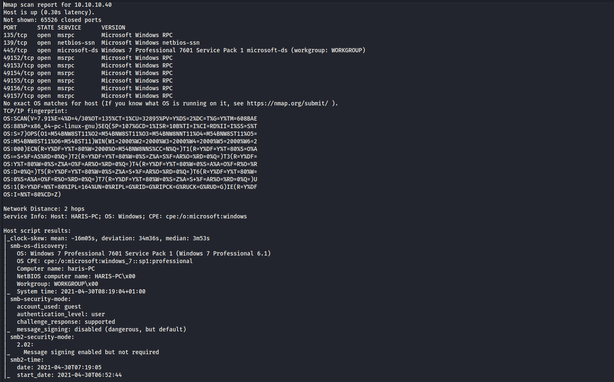
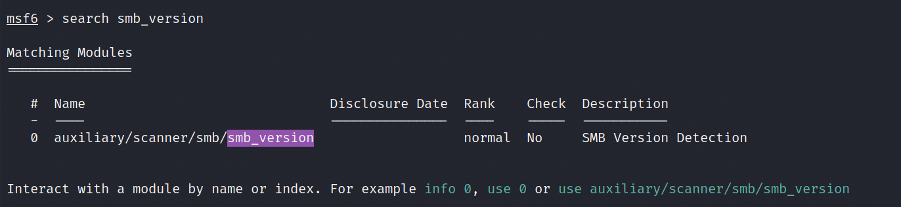
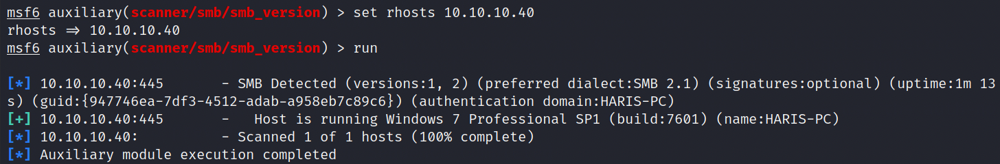
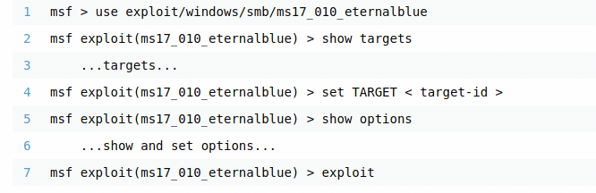
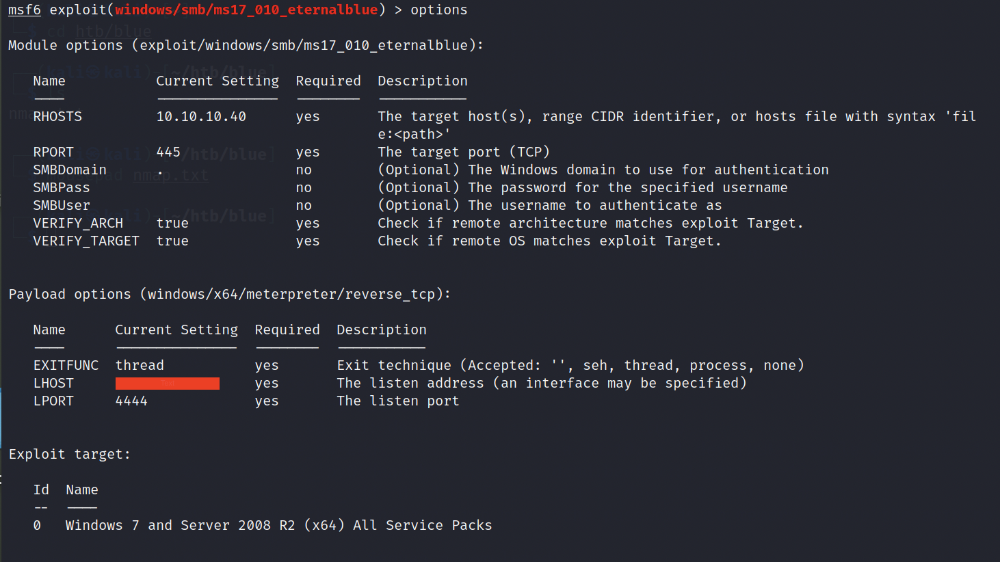
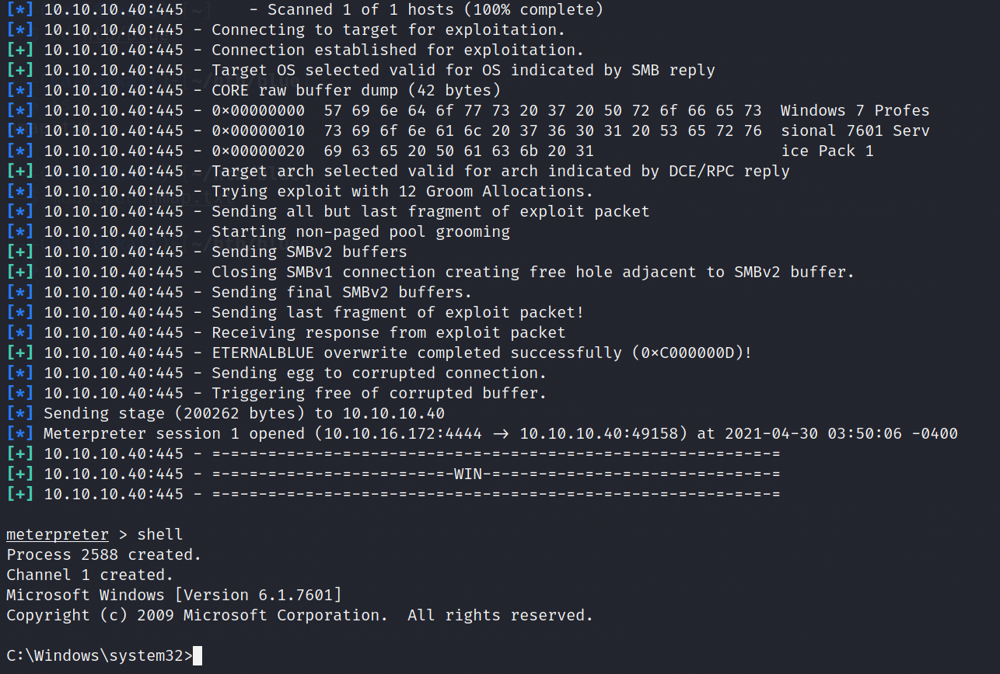

# Blue-Walkthrough
 Blue (pawned): https://www.hackthebox.eu/achievement/machine/423459/51
 
1. Use Nmap to scan the IP Address(10.10.10.40) for the machine
```bash
nmap -T4 -p- -A 10.10.10.40
```


2. From the above scan, it is evident that ports 139 and 445 are open. As a result, we can begin enumerating for SMB vulnerability. To begin SMB enumeration, we shall use Metasploit framework:
```bash
msfconsole
```
3. We need to find the SMB Version for the given machine. As a result we shall use the smb_version auxillary in Metasploit
```bash
search smb_version
use 0
```


4. Before running the enumeration, we need to make sure that the target hosts are set accordingly. Using the following command shall set the required rhosts to the target host, i.e. 10.10.10.40:
```bash
set rhosts 10.10.10.40
```

5. Upon running the enumeration, we gather the following information:



6. Looking for 'smb exploit for Windows 7 Professional SP1 (build:7601)', we gather the follwing:



7.  Using the above commands, setting the rhosts to 10.10.10.40 and lhost to the IP Address of your machine:



8.  Upon initiating 'run', we see that a meterpreter session has been initiated and typing in ```shell``` gives us access to the machine's terminal:



9.  Looking through the files, you can gather the root as well as the user flag.
